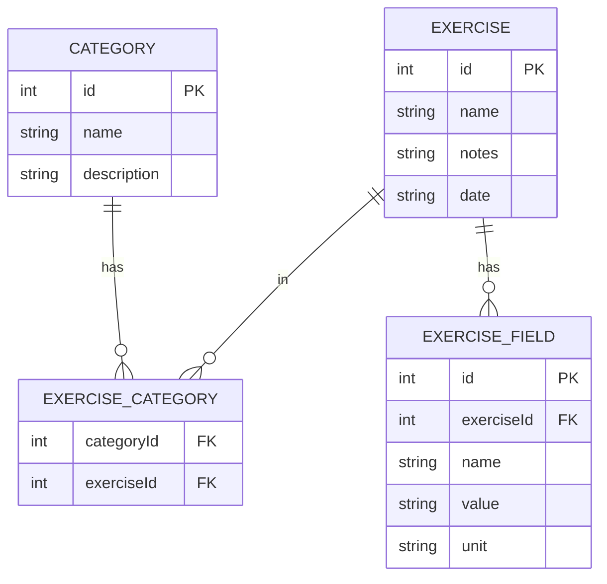

# Assignment: Iteration 1 — Basic Frontend

**Project:** Exercise/Workout Tracker  
**Iteration:** 1 of 4  
**Focus:** Build a working frontend with navigation, core pages, and mock data. No backend or database.

**Scope:** This iteration covers **Exercise**, **ExerciseField**, **Category**, and **ExerciseCategory** only. Additional types will be implemented in later iterations.

### Data model (ER diagram)

The following diagram shows the entities and relationships used in this iteration. All ids are integers/numbers. Note that the diagram is just initial one, and might be updated in up coming iterations.



- **Category** — Reusable categories (e.g. Cardio, Strength, Running).
- **Exercise** — A single exercise record (e.g. bench press, morning run).
- **ExerciseCategory** — Junction table: many-to-many between Exercise and Category (one exercise can have multiple categories).
- **ExerciseField** — Detail fields for an exercise (e.g. weight 100 kg, sets 3, reps 8).

---

## 1. Learning objectives

By the end of this assignment you will have:

- A React + TypeScript frontend running locally with Vite.
- TypeScript types: **domain models** (mirroring the ERD for mock data) and **DTOs** (Data Transfer Objects) used by the UI instead of raw database-like models.
- A mock data layer and a data service that returns exercise DTOs, with a clear interface for later API replacement.
- Core pages: exercises list and exercise detail.
- Reusable UI components and a consistent layout using Tailwind CSS and DaisyUI.
- Client-side filtering (by date and category) on the exercises list.

---

## 2. Prerequisites

- **Node.js** (LTS, e.g. 18 or 20) and npm (or yarn/pnpm).
- Basic knowledge of **React**, **TypeScript**, and **React Router**.

---

## 3. Detailed instructions

### 3.1 Project setup

1. **Create the React app with Vite and TypeScript**

   - In the project root (`LearningProject`), run:
     ```bash
     npm create vite@latest frontend -- --template react-ts
     ```
   - Go into `frontend` and install dependencies: `npm install`.

2. **Install and configure Tailwind CSS**

   - In `frontend`, run:
     ```bash
     npm install -D tailwindcss postcss autoprefixer
     npx tailwindcss init -p
     ```
   - In `tailwind.config.js` (or `.ts`), set `content` to include your source files, e.g.:
     ```js
     content: ["./index.html", "./src/**/*.{js,ts,jsx,tsx}"],
     ```
   - In `src/index.css`, add the Tailwind directives:
     ```css
     @tailwind base;
     @tailwind components;
     @tailwind utilities;
     ```
     - You can delete all other css styles from the file

3. **Install DaisyUI**

   - Run: `npm install daisyui`
   - In `tailwind.config.js`, add `daisyui` to the `plugins` array. Optionally pick a theme in `theme.extend` or `daisyui.themes`.

4. **Install React Router**

   - Run: `npm install react-router-dom`
   - Routing is configured in **`src/App.tsx`** (see section 3.5 step 4 and 3.8). Keep `src/main.tsx` minimal: it should only render `<App />`. Do not define routes in `main.tsx`.

5. **Verify**
   - Run `npm run dev` and open the app in the browser. Confirm Tailwind and DaisyUI styles apply (e.g. add a DaisyUI button on the default page temporarily).

---

### 3.2 TypeScript types: domain models and DTOs

Use two layers of types: **domain models** (for mock data and service internals, mirroring the ERD) and **DTOs** (Data Transfer Objects) that the UI and data service API use. The UI should consume only DTOs, not raw domain models.

1. **Create** `src/types/index.ts` (or split into `src/types/domain.ts` and `src/types/dto.ts` if you prefer).

2. **Domain models** (used in mock data and inside the data service to build DTOs). All ids are `number`. Define these first; they mirror the ERD.

   - **Category**

     - `id: number`
     - `name: string`
     - `description: string`

   - **Exercise**

     - `id: number`
     - `name: string`
     - `notes: string`
     - `date: string` (ISO date or datetime string)

   - **ExerciseCategory** (junction: Exercise ↔ Category)

     - `categoryId: number`
     - `exerciseId: number`

   - **ExerciseField**
     - `id: number`
     - `exerciseId: number`
     - `name: string` (e.g. "weight", "sets", "reps")
     - `value: string` (e.g. "100", "3")
     - `unit: string` (e.g. "kg", "reps", "km")

3. **Exercise DTOs** (used by the UI and returned by the data service instead of raw domain models):

   - **ExerciseListItemDto** — for the exercises list page and cards.

     - `id: number`
     - `name: string`
     - `date: string`
     - `notes: string`
     - `categories: CategoryDto[]` (or a minimal `{ id: number; name: string }[]` if you prefer to keep Category as domain-only and have a small view type)

   - **ExerciseDetailDto** — for the exercise detail page.

     - `id: number`
     - `name: string`
     - `date: string`
     - `notes: string`
     - `categories: CategoryDto[]`
     - `fields: ExerciseFieldDto[]`

   - **ExerciseFieldDto** — for displaying a single field (no foreign keys in the DTO).

     - `id: number`
     - `name: string`
     - `value: string`
     - `unit: string`

   - **CategoryDto** — for use inside exercise DTOs (can match Category if you prefer a single type).
     - `id: number`
     - `name: string`
     - `description: string`

4. **Usage:** Mock data and the data service’s internal logic use domain types (`Exercise`, `ExerciseField`, `Category`, `ExerciseCategory`). The service’s **public** functions return DTOs (`ExerciseListItemDto`, `ExerciseDetailDto`). Pages and components (e.g. `ExerciseCard`, `ExerciseFieldList`) receive and use only DTOs. This keeps the UI decoupled from the raw database shape and makes the API contract clear for Iteration 2.

---

### 3.3 Mock data

Create mock data files under `src/data/` (or `src/mocks/`). Use integer ids so references are stable and easy to match across files. **Only exercise-related data**.

1. **`src/data/mockCategories.ts`**

   - Export an array of at least 4–5 **Category** (domain) objects (e.g. "Cardio", "Strength", "Running", "Swimming", "Trail").

2. **`src/data/mockExercises.ts`**

   - Export an array of at least 5–6 **Exercise** (domain) objects with different `name`, `notes`, and `date` values.
   - Ensure each exercise has a valid `id` that you can reference from **ExerciseCategory** and **ExerciseField**.

3. **`src/data/mockExerciseCategories.ts`**

   - Export an array of **ExerciseCategory** linking exercises to categories (many-to-many). Some exercises should have multiple categories.

4. **`src/data/mockExerciseFields.ts`**

   - Export an array of **ExerciseField** (domain) objects. Examples:
     - Exercise "Bench press" → fields: weight 100 kg, sets 3, reps 3.
     - Exercise "Morning run" → fields: distance 5 km, duration 30 min.
   - Each field must have `exerciseId` matching an exercise in `mockExercises`.

5. **Example mock data** — Below are concrete examples you can copy or adapt. Use the same ids across files so relations resolve correctly.

   **`mockCategories.ts`** (domain type `Category`: `id`, `name`, `description`; use `id: number`):

   ```ts
   export const mockCategories = [
     { id: 1, name: 'Cardio', description: 'Cardiovascular exercises' },
     { id: 2, name: 'Strength', description: 'Resistance and weight training' },
     { id: 3, name: 'Running', description: 'Running and jogging' },
     { id: 4, name: 'Swimming', description: 'Pool and open water swimming' },
     { id: 5, name: 'Trail', description: 'Trail and outdoor activities' },
   ];
   ```

   **`mockExercises.ts`** (domain type `Exercise`: `id`, `name`, `notes`, `date`; use `id: number`):

   ```ts
   export const mockExercises = [
     {
       id: 1,
       name: 'Bench press',
       notes: 'Flat bench, felt strong',
       date: '2025-02-01T10:00:00Z',
     },
     {
       id: 2,
       name: 'Morning run',
       notes: 'Easy 5k along the river',
       date: '2025-02-02T07:30:00Z',
     },
     {
       id: 3,
       name: 'Swimming laps',
       notes: '30 min freestyle',
       date: '2025-02-02T18:00:00Z',
     },
     {
       id: 4,
       name: 'Squats',
       notes: 'Back squat 4x5',
       date: '2025-02-03T09:00:00Z',
     },
     {
       id: 5,
       name: 'Trail run',
       notes: 'Hilly 8k',
       date: '2025-01-28T08:00:00Z',
     },
     {
       id: 6,
       name: 'Deadlift',
       notes: 'Conventional 3x5',
       date: '2025-02-01T10:45:00Z',
     },
   ];
   ```

   **`mockExerciseCategories.ts`** (domain type `ExerciseCategory`: `categoryId`, `exerciseId`; use `number` for both):

   ```ts
   export const mockExerciseCategories = [
     { categoryId: 2, exerciseId: 1 }, // Bench press → Strength
     { categoryId: 2, exerciseId: 4 }, // Squats → Strength
     { categoryId: 2, exerciseId: 6 }, // Deadlift → Strength
     { categoryId: 1, exerciseId: 2 }, // Morning run → Cardio
     { categoryId: 3, exerciseId: 2 }, // Morning run → Running
     { categoryId: 1, exerciseId: 3 }, // Swimming laps → Cardio
     { categoryId: 4, exerciseId: 3 }, // Swimming laps → Swimming
     { categoryId: 1, exerciseId: 5 }, // Trail run → Cardio
     { categoryId: 3, exerciseId: 5 }, // Trail run → Running
     { categoryId: 5, exerciseId: 5 }, // Trail run → Trail
   ];
   ```

   **`mockExerciseFields.ts`** (domain type `ExerciseField`: `id`, `exerciseId`, `name`, `value`, `unit`; use `id: number`, `exerciseId: number`):

   ```ts
   export const mockExerciseFields = [
     // Bench press (exerciseId 1)
     { id: 1, exerciseId: 1, name: 'weight', value: '100', unit: 'kg' },
     { id: 2, exerciseId: 1, name: 'sets', value: '3', unit: 'reps' },
     { id: 3, exerciseId: 1, name: 'reps', value: '8', unit: 'reps' },
     // Morning run (exerciseId 2)
     { id: 4, exerciseId: 2, name: 'distance', value: '5', unit: 'km' },
     { id: 5, exerciseId: 2, name: 'duration', value: '30', unit: 'min' },
     // Swimming laps (exerciseId 3)
     { id: 6, exerciseId: 3, name: 'duration', value: '30', unit: 'min' },
     { id: 7, exerciseId: 3, name: 'laps', value: '20', unit: 'laps' },
     // Squats (exerciseId 4)
     { id: 8, exerciseId: 4, name: 'weight', value: '120', unit: 'kg' },
     { id: 9, exerciseId: 4, name: 'sets', value: '4', unit: 'reps' },
     { id: 10, exerciseId: 4, name: 'reps', value: '5', unit: 'reps' },
     // Trail run (exerciseId 5)
     { id: 11, exerciseId: 5, name: 'distance', value: '8', unit: 'km' },
     { id: 12, exerciseId: 5, name: 'duration', value: '45', unit: 'min' },
     // Deadlift (exerciseId 6)
     { id: 13, exerciseId: 6, name: 'weight', value: '140', unit: 'kg' },
     { id: 14, exerciseId: 6, name: 'sets', value: '3', unit: 'reps' },
     { id: 15, exerciseId: 6, name: 'reps', value: '5', unit: 'reps' },
   ];
   ```

   When building DTOs in the data service, resolve categories for each exercise via `mockExerciseCategories` (e.g. "Morning run" gets categories Cardio and Running) and fields via `mockExerciseFields` (e.g. "Bench press" gets weight 100 kg, sets 3, reps 8).

You can re-export all mocks from a single `src/data/index.ts` for simpler imports.

---

### 3.4 Data service layer

The data service should be the **only** place that “fetches” data. It **returns DTOs** to the UI, not raw domain models. In Iteration 2 you will replace the implementation with real API calls without changing the callers (same return types).

1. **Create** `src/services/dataService.ts` (or split into `exerciseService.ts` and `categoryService.ts`).

2. **Implement the following interface** using the mock data. Internally use domain types; **map to DTOs** before returning.

   - **Categories** (can return domain `Category` or `CategoryDto`; if they are identical, one type is fine)

     - `getCategories(): Promise<CategoryDto[]>` (or `Category[]`)
     - `getCategoryById(id: number): Promise<CategoryDto | undefined>`

   - **Exercises** (must return DTOs)
     - `getExercises(): Promise<ExerciseListItemDto[]>` — all exercises with categories resolved; no need to include full fields on the list.
     - `getExerciseById(id: number): Promise<ExerciseDetailDto | undefined>` — one exercise with `categories` and `fields` as DTOs.

3. **Implementation detail:** Inside the service, read from mock domain data (Exercise, ExerciseField, Category, ExerciseCategory). Resolve relations (e.g. for each exercise, get linked categories and fields), then **map** to `ExerciseListItemDto` and `ExerciseDetailDto` (and `ExerciseFieldDto`). Return only these DTOs. No raw `Exercise` or `ExerciseField` with `exerciseId` should be returned to the UI.

4. **Return types:** The public API of the service uses only DTO types. Keep these function signatures so that in Iteration 2 you can swap the body to `fetch(...)` and keep the same return types.

5. **Example implementation** — `src/services/dataService.ts` using mock data and mapping to DTOs:

   ```ts
   import { mockCategories } from '../data/mockCategories';
   import { mockExerciseCategories } from '../data/mockExerciseCategories';
   import { mockExerciseFields } from '../data/mockExerciseFields';
   import { mockExercises } from '../data/mockExercises';
   import type {
     CategoryDto,
     ExerciseListItemDto,
     ExerciseDetailDto,
     ExerciseFieldDto,
   } from '../types';

   function categoryToDto(c: {
     id: number;
     name: string;
     description: string;
   }): CategoryDto {
     return { id: c.id, name: c.name, description: c.description };
   }

   function fieldToDto(f: {
     id: number;
     name: string;
     value: string;
     unit: string;
   }): ExerciseFieldDto {
     return { id: f.id, name: f.name, value: f.value, unit: f.unit };
   }

   export async function getCategories(): Promise<CategoryDto[]> {
     return Promise.resolve(mockCategories.map(categoryToDto));
   }

   export async function getCategoryById(
     id: number
   ): Promise<CategoryDto | undefined> {
     const cat = mockCategories.find((c) => c.id === id);
     return Promise.resolve(cat ? categoryToDto(cat) : undefined);
   }

   export async function getExercises(): Promise<ExerciseListItemDto[]> {
     const categoriesById = Object.fromEntries(
       mockCategories.map((c) => [c.id, c])
     );
     return Promise.resolve(
       mockExercises.map((ex) => {
         const categoryIds = mockExerciseCategories
           .filter((ec) => ec.exerciseId === ex.id)
           .map((ec) => ec.categoryId);
         const categories = categoryIds
           .map((id) => categoriesById[id])
           .filter(Boolean)
           .map(categoryToDto);
         return {
           id: ex.id,
           name: ex.name,
           date: ex.date,
           notes: ex.notes,
           categories,
         };
       })
     );
   }

   export async function getExerciseById(
     id: number
   ): Promise<ExerciseDetailDto | undefined> {
     const ex = mockExercises.find((e) => e.id === id);
     if (!ex) return Promise.resolve(undefined);

     const categoryIds = mockExerciseCategories
       .filter((ec) => ec.exerciseId === ex.id)
       .map((ec) => ec.categoryId);
     const categories = mockCategories
       .filter((c) => categoryIds.includes(c.id))
       .map(categoryToDto);

     const fields = mockExerciseFields
       .filter((f) => f.exerciseId === ex.id)
       .map(fieldToDto);

     return Promise.resolve({
       id: ex.id,
       name: ex.name,
       date: ex.date,
       notes: ex.notes,
       categories,
       fields,
     });
   }
   ```

   Helper functions `categoryToDto` and `fieldToDto` map domain objects to DTOs. `getExercises` builds a lookup of categories by id, then for each exercise resolves linked categories via `mockExerciseCategories` and returns list DTOs without fields. `getExerciseById` finds the exercise, resolves categories and fields, and returns a detail DTO.

---

### 3.5 Layout components

Create a simple layout so every page shares the same header and navigation.

1. **`src/components/layout/Header.tsx`**

   - Display the app name (e.g. "Exercise Tracker") and optionally a short tagline. Use a DaisyUI navbar or a simple header with Tailwind.

2. **`src/components/layout/Nav.tsx`**

   - Link to **Exercises** (list) only — e.g. `/exercises`.
   - Use React Router’s `Link` or `NavLink` and DaisyUI menu/tabs so the active route can be highlighted.

3. **`src/components/layout/Main.tsx`** (or `Layout.tsx`)

   - Renders `Header`, `Nav`, and then the main content area. The content area must be a React Router **`<Outlet />`** so that child routes (e.g. ExerciseListPage, ExerciseDetailPage) render inside the layout. Wrap the outlet in a container (e.g. `max-w-7xl mx-auto px-4 py-6`).

4. **Configure routing in `src/App.tsx`**

   - Define all routes in **App.tsx**. Use `BrowserRouter` as the outermost wrapper, then `Routes`, then a **layout route** whose `element` is `<Layout />`. Put the layout’s child routes inside that `<Route>` so they render in the layout’s `<Outlet />`.
   - **Layout route:** `path="/"` with `element={<Layout />}`. No `element` on the parent for the index/child routes; the children define what renders in the outlet.
   - **Child routes:** `index` with `element={<Navigate to="/exercises" replace />}` so `/` redirects to `/exercises`; `path="exercises"` with `element={<ExerciseListPage />}`; `path="exercises/:id"` with `element={<ExerciseDetailPage />}`.
   - **Example implementation** for `src/App.tsx`:

   ```tsx
   import { BrowserRouter, Routes, Route, Navigate } from 'react-router-dom';
   import { Layout } from './components/layout/Layout';
   import { ExerciseListPage } from './pages/ExerciseListPage';
   import { ExerciseDetailPage } from './pages/ExerciseDetailPage';

   export default function App() {
     return (
       <BrowserRouter>
         <Routes>
           <Route path="/" element={<Layout />}>
             <Route index element={<Navigate to="/exercises" replace />} />
             <Route path="exercises" element={<ExerciseListPage />} />
             <Route path="exercises/:id" element={<ExerciseDetailPage />} />
           </Route>
         </Routes>
       </BrowserRouter>
     );
   }
   ```

   - The `Layout` component must render an `<Outlet />` (from `react-router-dom`) where the matched child route (ExerciseListPage or ExerciseDetailPage) should appear. That way the header and nav stay visible on every page.

---

### 3.6 Reusable UI components

Build small, presentational components that consume **DTOs** (not raw domain models). Use them on the list and detail pages.

1. **`src/components/CategoryBadge.tsx`**

   - **Props:** `category: CategoryDto` (or `{ name: string }` if you only need the name).
   - **Behaviour:** Renders the category name as a DaisyUI badge. Use a neutral or theme color so multiple badges look good side by side.

2. **`src/components/ExerciseCard.tsx`**

   - **Props:** `exercise: ExerciseListItemDto`.
   - **Behaviour:** Shows exercise `name`, `date` (formatted), and `notes` (truncated if long). Renders `exercise.categories` with `CategoryBadge`. Include a link (e.g. React Router `Link`) to the exercise detail page (`/exercises/:id`). Use a DaisyUI card.

3. **`src/components/ExerciseFieldList.tsx`**

   - **Props:** `fields: ExerciseFieldDto[]`.
   - **Behaviour:** Renders a list of fields, each as “name: value unit” (e.g. "weight: 100 kg", "sets: 3 reps"). Use a DaisyUI list or table; keep it read-only.

Place these under `src/components/` and import them where needed. Prefer composition (e.g. use `CategoryBadge` inside `ExerciseCard`).

---

### 3.7 Pages

Implement the two main views (exercises list and exercise detail) and connect them to the data service and router.

#### 3.7.1 Exercises list page

- **Route:** `/exercises` (and optionally `/` redirecting to `/exercises`).
- **Data:** Call `dataService.getExercises()` and `dataService.getCategories()` (e.g. in a single `useEffect` on mount). The former returns `ExerciseListItemDto[]` (each item already includes `categories`); the latter returns categories for the category filter UI.
- **UI:**
  - A heading (e.g. "Exercises").
  - **Filters (client-side):**
    - By **date:** e.g. “All” / “Today” / “This week” / “This month”, or a date range. Filter the list based on `exercise.date`.
    - By **category:** dropdown or checkboxes of categories (load with `getCategories()`); filter exercises that have at least one of the selected categories (using `exercise.categories` on the DTO).
  - List of **ExerciseCard** components, each receiving an item from the **filtered** list (see Filter implementation below). If the filtered list is empty, show a short message (e.g. "No exercises match the filters").
- **State:** Keep the full exercise list and category list in state; keep the selected date filter and selected category filter(s) in state; **derive** the filtered list from these (e.g. with `useMemo`) so you have a single source of truth.

**Filter implementation (detailed)**

Implement both filters on the client: no API calls when the user changes a filter; filter the already-loaded exercise list in memory.

1. **State for filters**

   - **Date filter:** One value, e.g. `'all' | 'today' | 'week' | 'month'`. Store with `useState`; default `'all'`.
   - **Category filter:** List of selected category ids (`number[]`). Store with `useState`; default `[]` (no category filter). When the user checks a category, add its `id` to the array; when unchecked, remove it.

   **Example (state):**

   ```tsx
   type DateFilter = 'all' | 'today' | 'week' | 'month';

   const [exercises, setExercises] = useState<ExerciseListItemDto[]>([]);
   const [categories, setCategories] = useState<CategoryDto[]>([]);
   const [dateFilter, setDateFilter] = useState<DateFilter>('all');
   const [categoryFilter, setCategoryFilter] = useState<number[]>([]);
   ```

2. **Date filter — UI**

   - Use a `<select>` (or similar) with options: "All", "Today", "This week", "This month". Bind `value` to your date filter state and `onChange` to update it. Optionally use DaisyUI classes (e.g. `select select-bordered`).

3. **Date filter — logic**

   - **All:** Include every exercise (no date condition).
   - **Today:** Include only exercises whose `date` (ISO string) falls on the current calendar day. Compare by parsing `exercise.date` to a `Date`, then check that it is on the same day as "today" (e.g. same year, month, date, or within the 24-hour window of the current day in local time).
   - **This week:** Include exercises whose `date` is within the last 7 days from the start of today (or from the start of the current week, if you prefer a fixed week boundary).
   - **This month:** Include exercises whose `date` is within the current calendar month (or last 30 days from today).
   - Write a small helper (e.g. `isInDateRange(exerciseDate: string, filter: 'all' | 'today' | 'week' | 'month'): boolean`) and use it when computing the filtered list. Use the **local** date for "today" boundaries (e.g. `new Date()` and `getFullYear()`, `getMonth()`, `getDate()`).

   **Example (date filter helper):**

   ```tsx
   function isInRange(dateStr: string, filter: DateFilter): boolean {
     if (filter === 'all') return true;
     const d = new Date(dateStr);
     const now = new Date();
     const todayStart = new Date(
       now.getFullYear(),
       now.getMonth(),
       now.getDate()
     );
     const weekAgo = new Date(todayStart);
     weekAgo.setDate(weekAgo.getDate() - 7);
     const monthAgo = new Date(todayStart);
     monthAgo.setMonth(monthAgo.getMonth() - 1);

     if (filter === 'today')
       return d >= todayStart && d < new Date(todayStart.getTime() + 86400000);
     if (filter === 'week') return d >= weekAgo;
     if (filter === 'month') return d >= monthAgo;
     return true;
   }
   ```

4. **Category filter — UI**

   - Load categories with `getCategories()` and store them in state. Render a checkbox (or multi-select dropdown) for each category. Each checkbox is checked when that category's `id` is in your category filter state. On toggle, add or remove that `id` from the category filter array (e.g. with a `toggleCategory(id: number)` function that updates state).

5. **Category filter — logic**

   - If **no categories are selected** (empty array): do not filter by category; include all exercises that pass the date filter.
   - If **one or more categories are selected:** include only exercises that have **at least one** of the selected categories. Use the DTO: `exercise.categories` is an array of `CategoryDto`; get the ids with `exercise.categories.map(c => c.id)`. An exercise passes if `categoryFilter.some(selectedId => exercise.categories.some(c => c.id === selectedId))` or equivalently if the sets of ids overlap.

6. **Computing the filtered list**

   - Apply **both** filters: first by date, then by category (or combine in one pass). Prefer deriving the filtered list (e.g. `useMemo` with dependencies `[exercises, dateFilter, categoryFilter]`) so that when the user changes a filter, the list updates without extra state. Render `ExerciseCard` for each item in this filtered list.

   **Example (filtered list + toggle):**

   ```tsx
   const filteredExercises = useMemo(() => {
     return exercises.filter((ex) => {
       if (!isInRange(ex.date, dateFilter)) return false;
       if (categoryFilter.length === 0) return true;
       const exCategoryIds = ex.categories.map((c) => c.id);
       return categoryFilter.some((id) => exCategoryIds.includes(id));
     });
   }, [exercises, dateFilter, categoryFilter]);

   const toggleCategory = (id: number) => {
     setCategoryFilter((prev) =>
       prev.includes(id) ? prev.filter((c) => c !== id) : [...prev, id]
     );
   };
   ```

7. **Empty state**
   - When the filtered list has length 0, show a message such as "No exercises match the filters" instead of an empty space. Do not show the full list when filters are active and yield no results.

**Example (filter UI + empty state):**

```tsx
<div className="flex flex-wrap gap-4 mb-6">
  <div>
    <label className="label">
      <span className="label-text font-medium">Date</span>
    </label>
    <select
      className="select select-bordered select-sm"
      value={dateFilter}
      onChange={(e) => setDateFilter(e.target.value as DateFilter)}
    >
      <option value="all">All</option>
      <option value="today">Today</option>
      <option value="week">This week</option>
      <option value="month">This month</option>
    </select>
  </div>
  <div>
    <label className="label">
      <span className="label-text font-medium">Category</span>
    </label>
    <div className="flex flex-wrap gap-2">
      {categories.map((cat) => (
        <label key={cat.id} className="label cursor-pointer gap-1">
          <input
            type="checkbox"
            className="checkbox checkbox-sm"
            checked={categoryFilter.includes(cat.id)}
            onChange={() => toggleCategory(cat.id)}
          />
          <span className="label-text">{cat.name}</span>
        </label>
      ))}
    </div>
  </div>
</div>;

{
  filteredExercises.length === 0 ? (
    <p className="text-base-content/70">No exercises match the filters.</p>
  ) : (
    <div className="grid gap-4 sm:grid-cols-1 md:grid-cols-2 lg:grid-cols-3">
      {filteredExercises.map((ex) => (
        <ExerciseCard key={ex.id} exercise={ex} />
      ))}
    </div>
  );
}
```

#### 3.7.2 Exercise detail page

- **Route:** `/exercises/:id`.
- **Data:** Call `dataService.getExerciseById(id)` using the `id` from the route params. React Router gives params as strings, so parse to a number (e.g. `Number(id)` or `parseInt(id, 10)`) before calling the service. The service returns `ExerciseDetailDto | undefined`.
- **UI:**
  - Show exercise **name**, **date** (formatted), and **notes**.
  - Show **categories** with `CategoryBadge` (using `exercise.categories` from the DTO).
  - Show **ExerciseFieldList** with the exercise’s fields.
  - A back or “Exercises” link to return to the list.
- **Edge cases:** If the exercise is not found (e.g. invalid id), show a “Not found” message and a link back to the list.

---

- A back link to the list.

---

### 3.8 Routing summary

Implement routing in **`src/App.tsx`** as described in section 3.5 step 4. Ensure the following routes are configured:

| Route            | Page / component                                                      | Description              |
| ---------------- | --------------------------------------------------------------------- | ------------------------ |
| `/`              | Redirect to `/exercises` (use `<Navigate to="/exercises" replace />`) | Home / default           |
| `/exercises`     | `ExerciseListPage`                                                    | List with filters        |
| `/exercises/:id` | `ExerciseDetailPage`                                                  | Single exercise + fields |

- Use a single **layout route** (`path="/"`, `element={<Layout />}`) so that Header and Nav wrap all pages. Define the three routes above as **nested routes** inside that layout route so they render in `Layout`’s `<Outlet />`.
- In **Layout**, render `Header`, then `Nav`, then `<Outlet />` (wrapped in a container). The outlet is where React Router injects the matched child route component.
- On the exercise detail page, pass `exercise.fields` (array of `ExerciseFieldDto`) to **ExerciseFieldList**.

---

## 4. Deliverables and acceptance criteria

- [ ] **Setup:** App runs with `npm run dev`. No console errors. Tailwind and DaisyUI are applied.
- [ ] **Types:** Domain types (Category, Exercise, ExerciseCategory, ExerciseField) and exercise DTOs (ExerciseListItemDto, ExerciseDetailDto, ExerciseFieldDto, CategoryDto) are defined. Mock data uses domain types; UI and data service API use DTOs.
- [ ] **Mock data:** At least 4–5 categories, 5–6 exercises, several exercise–category links, and several exercise fields.
- [ ] **Data service:** Returns DTOs only. `getCategories()`, `getCategoryById()`, `getExercises()` (returns `ExerciseListItemDto[]`), `getExerciseById()` (returns `ExerciseDetailDto | undefined`).
- [ ] **Layout:** Header and Nav appear on every page; Nav has link to Exercises only; active route can be highlighted.
- [ ] **Components:** CategoryBadge, ExerciseCard (props: ExerciseListItemDto), ExerciseFieldList (props: ExerciseFieldDto[]) are implemented and used.
- [ ] **Exercises list:** Shows exercises (DTOs); filtering by date and by category works (client-side).
- [ ] **Exercise detail:** Shows one exercise (ExerciseDetailDto) with fields and categories; “not found” handled.
- [ ] **Code quality:** No hardcoded data in pages; data comes from the data service. UI components receive only DTOs; no raw domain models in pages or presentational components.

---

## 5. Suggested file structure

After Iteration 1, your `frontend/src` could look like this:

```
src/
├── main.tsx
├── App.tsx                 # Router and layout
├── index.css
├── types/
│   └── index.ts            # Domain types + exercise DTOs (CategoryDto, ExerciseListItemDto, ExerciseDetailDto, ExerciseFieldDto)
├── data/
│   ├── mockCategories.ts
│   ├── mockExercises.ts
│   ├── mockExerciseCategories.ts
│   └── mockExerciseFields.ts
├── services/
│   └── dataService.ts      # Returns DTOs; mock-based; replace in I2
├── components/
│   ├── layout/
│   │   ├── Header.tsx
│   │   ├── Nav.tsx
│   │   └── Main.tsx
│   ├── CategoryBadge.tsx
│   ├── ExerciseCard.tsx
│   └── ExerciseFieldList.tsx
└── pages/
    ├── ExerciseListPage.tsx
    └── ExerciseDetailPage.tsx
```

You can adjust names (e.g. `ExerciseList.tsx` instead of `ExerciseListPage.tsx`) or split types into `domain.ts` and `dto.ts` as long as structure is clear.

---

## 6. Optional extensions

- **Loading state:** In the data service, wrap the return in `Promise.resolve(...)` and add a short artificial delay; in pages, show a loading spinner or skeleton while “fetching”.
- **Empty states:** Dedicated components or messages when there are no exercises or no results after filtering.
- **Date formatting:** Use a small helper or library (e.g. `date-fns`) to format `exercise.date` consistently (e.g. “3 Feb 2025” or “Today, 14:30”).
- **Responsive design:** Ensure the layout and cards look good on mobile (stack filters, single column for cards).
- **Accessibility:** Semantic HTML, `aria-label` on nav links, and keyboard navigation where relevant.

---

## 7. References

- **ERD / data model:** See the project’s Entity-Relationship Diagram. This iteration uses Exercise, ExerciseField, Category, and ExerciseCategory only.
- **DaisyUI:** [daisyui.com](https://daisyui.com) — components and themes.
- **React Router:** [reactrouter.com](https://reactrouter.com) — routing and `useParams`, `Link`, `NavLink`, `Outlet`.
- **Vite:** [vitejs.dev](https://vitejs.dev) — project structure and scripts.

---
